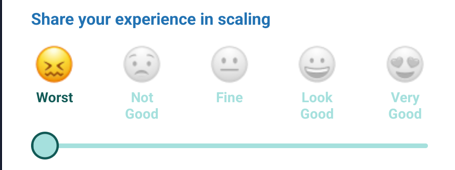
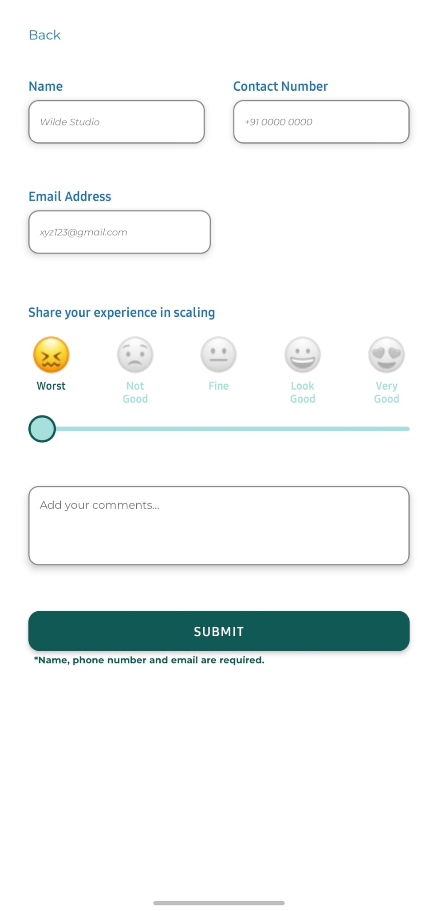
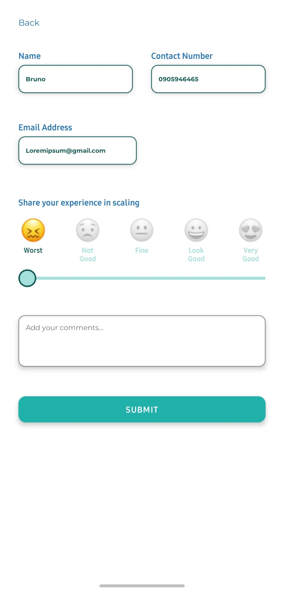
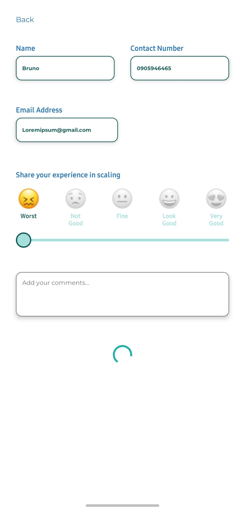
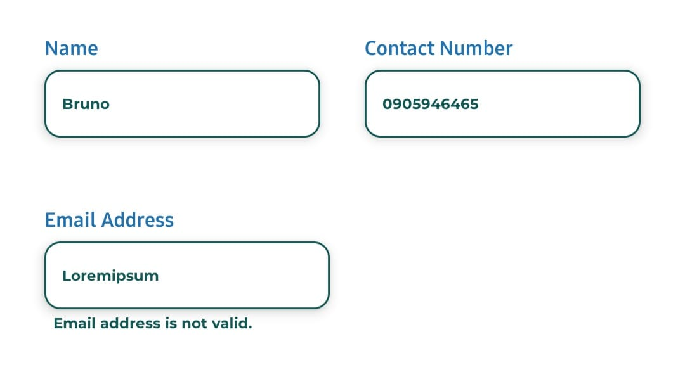

# zaradevassignment
Jednostavan React Native zadatak za prijavu na posao.

Za ovaj zadatak koristio sam React Native te expo dependency. (npm i expo)
Kako bih implementirao novi font u aplikaciju, koristio sam expo-google-fonts dodatak koji sam isto intalirao putem npm-a u terminalu.
Za slider sam koristio react-native-elements.

## Dizajn

Dizajn aplikacije koji je dostupan na Figmi je dosta opširan stoga nisam imao potrebe previše ulaziti u izmjene i dopune.
Ono što sam primjetio prilikom pokretanja prototipa u Figmi jest da se smajlići na slideru gibaju jer su u GIFF formatu. Ja to nisam mogao (uspio) preuzeti s Figme pa sam stoga koristio png datoteke koje sam uspio preuzeti. Zbog toga se smajlići ne gibaju kad se odabere njihova vrijednost, ali dobiju boju kako je prikazano u Figmi.

Kad je riječ o validaciji - polja za unos imena, kontakta i emaila su obavezna i dok se ona ne unesu, gumb "Submit" nije moguće pritisnuti.

Kad se unesu sva obavezna polja, gumb postaje svjetliji, a tekst sa informacijom o obazenim poljima nestaje i onda ga korisnik može pritisnuti.

Nakon što korisnik pritisne na gumb pojavljuje se spinner za učitavanje na mjestu tog gumba.

Validacija emaila također postoji i sve dok korisnik ne unese ispravnu email adresu prikazivat će mu se poruka ispod polja za unos da email adresa nije u ispravnom formatu.

